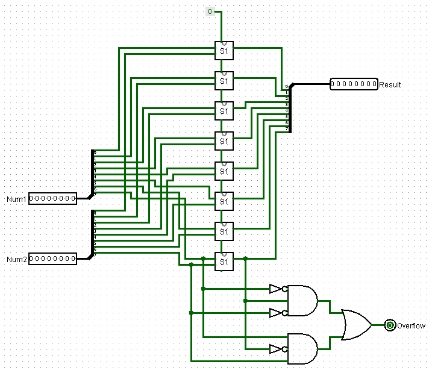
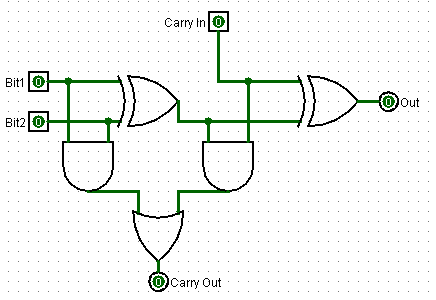

# Projeto MAC0329

Artur Alvarez		9292931

Bruno Arico         8125459

Gabriel Capella     8962078

Nicolas Nogueira    9277541

### Estrutura do Projeto
O primeira parte do projeto consiste no desenvolvimento de uma Unidade Lógica e Aritmética (ALU – Arithmetic and Logic Unit) a ser usada futuramente na simulação de um HIPO.

Para este EP, a ALU deverá fazer as seguintes operações aritméticas sobre números inteiros: soma, subtração, multiplicação e divisão. Além disso deverá ter verificação de transbordamento (overflow).

### Descrição da ALU
A ALU deverá ter 8 bits e operar com complemento de 2, ou seja, os valores de entrada ou saída estão contidos no intervalo [−128, 127].

Utilizamos a funcionalidade do logisim que permitiu modularizar as operações. Deste modo temos arquivos distintos para soma (SomaLib.circ), quociente (QuocLib.circ) e multiplicação (MultLib.circ) e um principal (ALU.circ) que junta todos para realizar as operações aritméticas da primeira parte do projeto.

#### Entrada
Para modificar os valores de entrada da ALU utilizaremos pinos de entrada. A ALU possui os seguintes pinos de entrada:

- 8 pinos nomeados de a7 ... a0, que representam a entrada A. Sendo a7 e a0, respectivamente, o bit mais e menos significativo.
- 8 pinos nomeados de b7 ... b0, que representam a entrada B.
- 3 pinos nomeados de s7 ... s0, que representam a entrada S, o seletor de operação.

##### Seletor
O seletor define qual operação deverá ser realizada pela ALU. E dependendo de qual valor da entrada é realizada a operação correspondente:

 S |            Operação
---|-------------------------------
000|             A + B
001|             A - B
010|             A * B
011|  quociente da divisão A por B
100|   resto da divisão A por B

#### Saída
A ALU contém os seguintes pinos de saída:

- 8 pinos, nomeados r7 ... r0, que representam a saída R.
- 1 pino, nomeado overflow, que representa a ocorrência de transbordamento.

##### Overflow

O pino de saída que indica overflow deverá ter valor 1 caso o mesmo ocorra, e 0 caso o contrário. E seguimos a seguinte definição de overflow:

- Se na soma de dois números positivos o resultado dá negativo ocorre overflow.
- Se na soma de dois números negativos o resultado dá positivo ocorre overflow.

### Circuito
O circuito é dividido em 3 partes: uma para a soma e subtração, uma para a multiplicação e divisão e uma para o seletor de saída.

#### Soma e subtração
As duas operações ficam na mesma parte do circuito por serem operações irmãs. Em ambas ocorre a soma de 8 bits, porém na operação de subtração o sinal do operando B é trocado (SC - signal change), e isto é controlado pelo valor de C1 (derivado das operações do seletor de saída que vale 1 para subtração e 0 para soma) na entrada do demultiplexador acoplado a B na parte de soma e subtração. Após a troca de sinal (ou não), é realizada a soma de 8 bits que retorna se houve overflow ou não (OF01) e o resultado da operação (R01).

##### Circuito da soma de 8 bits

O circuito da soma de 8 bits é formado por uma cadeia de operações de soma de 1 bit (full adder) onde cada operação retorna o valor de um bit da resposta. Ao final verifica se houveram ocasiões de overflow (soma de dois positivos que deram resultado negativo ou de dois negativos que deram resultado positivo).

#### Multiplicação

##### Circuito da multiplicação

#### Divisão

##### Circuito da divisão

#### Seletor de saída

http://ba.mirror.garr.it/1/groundup/arithmetic_logic_unit.html http://alex9ufoexploer.blogspot.com.br/2013/12/how-do-computers-do-math.html