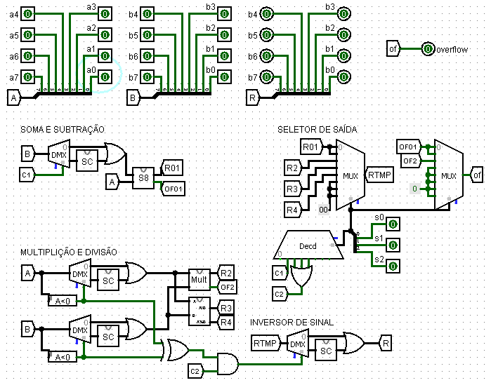

# Projeto MAC0329

Artur Alvarez		9292931

Bruno Arico         8125459

Gabriel Capella     8962078

Nicolas Nogueira    9277541

### Estrutura do Projeto
O primeira parte do projeto consiste no desenvolvimento de uma Unidade Lógica e Aritmética (ALU – Arithmetic and Logic Unit) a ser usada futuramente na simulação de um HIPO.

Para este EP, a ALU deverá fazer as seguintes operações aritméticas sobre números inteiros: soma, subtração, multiplicação e divisão. Além disso deverá ter verificação de transbordamento (overflow).

### Descrição da ALU
A ALU deverá ter 8 bits e operar com complemento de 2, ou seja, os valores de entrada ou saída estão contidos no intervalo [−128, 127].

Utilizamos a funcionalidade do logisim que permitiu modularizar as operações. Deste modo temos arquivos distintos para soma (SomaLib.circ), quociente (QuocLib.circ) e multiplicação (MultLib.circ) e um principal (ALU.circ) que junta todos para realizar as operações aritméticas da primeira parte do projeto.

#### Entrada
Para modificar os valores de entrada da ALU utilizaremos pinos de entrada. A ALU possui os seguintes pinos de entrada:

- 8 pinos nomeados de a7 ... a0, que representam a entrada A. Sendo a7 e a0, respectivamente, o bit mais e menos significativo.
- 8 pinos nomeados de b7 ... b0, que representam a entrada B.
- 3 pinos nomeados de s7 ... s0, que representam a entrada S, o seletor de operação.

##### Seletor
O seletor define qual operação deverá ser realizada pela ALU. E dependendo de qual valor da entrada é realizada a operação correspondente:

 S |            Operação
---|-------------------------------
000|             A + B
001|             A - B
010|             A * B
011|  quociente da divisão A por B
100|   resto da divisão A por B

#### Saída
A ALU contém os seguintes pinos de saída:

- 8 pinos, nomeados r7 ... r0, que representam a saída R.
- 1 pino, nomeado overflow, que representa a ocorrência de transbordamento.

##### Overflow

O pino de saída que indica overflow deverá ter valor 1 caso o mesmo ocorra, e 0 caso o contrário. E seguimos a seguinte definição de overflow:

- Se na soma de dois números positivos o resultado dá negativo ocorre overflow.
- Se na soma de dois números negativos o resultado dá positivo ocorre overflow.

### Circuito
O circuito é dividido em 3 partes: uma para a soma e subtração, uma para a multiplicação e divisão e uma para o seletor de saída.

#### Soma e subtração
As duas operações ficam na mesma parte do circuito por serem operações irmãs. Em ambas ocorre a soma de 8 bits, porém na operação de subtração o sinal do operando B é trocado (SC - signal change), e isto é indicado pelo valor de C1 (derivado das operações do seletor de saída que vale 1 para subtração e 0 para soma) na entrada do demultiplexador acoplado a B na parte de soma e subtração. Após a troca de sinal (ou não), é realizada a soma de 8 bits que retorna se houve overflow ou não (OF01) e o resultado da operação (R01).

##### Circuito da soma de 8 bits
O circuito da soma de 8 bits é formado por uma cadeia de operações de soma de 1 bit (full adder) onde cada operação retorna o valor de um bit da resposta. Ao final verifica se houveram ocasiões de overflow (soma de dois positivos que deram resultado negativo ou de dois negativos que deram resultado positivo).

#### Multiplicação e divisão
As duas operações ficam na mesma partes por realizarem uma checagem de sinal, ou seja, as operações em si são realizadas somente com números positivos (em casos de números negativos ocorre a troca de sinal), a verificação do sinal é aplicada direto no resultado das operações.

##### Inversor de sinal
Por ter que fazer a verificação de sinal na multiplicação e divisão, encontra-se acoplado à parte de multiplicação e divisão um inversor de sinal que é um tratamento para um resultado temporário (RTMP) de qualquer uma das operações da ALU (recebido do seletor de saída) em que ocorre troca de sinal do resultado somente em casos em que a operação do seletor é uma multiplicação ou divisão indicado pelo valor de um AND entre C2 (derivado das operações do seletor de saída que vale 1 para operação de multiplicação ou divisão e vale 0 para as demais) e o resultado do XOR dos bits mais significativos de cada operando. O resultado com troca de sinal ou não é repassado para a saída definitiva R.

##### Circuito da multiplicação
A operação de multiplicação consiste analisar o multiplicador bit a bit e a para cada bit analisado realizar um AND entre todos os bits do multiplicando.
Para o 1º bit do multiplicador (bit numero n=0, contando-se da direita para a esquerda), como primeiro passo, realiza-se n shifts no multiplicando e então faz-se um AND entre este bit n do multiplicador e todos os 8-n bits do multiplicando, o resultado é guardado e somado bit a bit com o proximo resultado, obtido  agora analisando o 2º bit do multiplicador (bit numero n=1, contando-se da direita para a esquerda), como primeiro passo, realiza-se n (agora com n=1) shifts no multiplicando e então faz-se um AND entre este bit n do multiplicador e todos os 8-n bits do multiplicando, o resultado é guardado e somado bit a bit com o proximo resultado obtido. Este procedimento é realizado recursivamente até n=7. Como antes de cada shift obtemos um bit do resultado desejado, o resultado (R2) é a composição desses bits. O overflow ocorre quando na última soma antes de cada shift ocorre overflow, deste forma o overflow da multiplicação (OF2) é um OR com todos os valores de overflow para a última soma antes de cada shift.

##### Circuito da divisão

#### Seletor de saída
O seletor de saída faz 3 operações que dependem dos valores do seletores da entrada S. A primeira das operações do seletor é dar valor para dois códigos C1 e C2 (através de um decodificador) que indicam circunstâncias para as operações; o C1 indica se a operação é uma subtração e o C2 indica se a operação é uma multiplicação, ou quociente ou resto. Outra operação do seletor é receber 4 entradas de resultados das operações e de acordo com o valor do seletor em um multiplexador filtrar qual entrada sair, esta saída é uma saída temporária que receberá tratamento no inversor de sinal. A última operaçao é tratar o overflow, do mesmo modo que os resultados das operações, os resultados de overflow (OF01 para a soma e subtração e 0F2 para a multiplicação) e de acordo com o seletor em outro multiplexador filtrar qual overflow é o da saída definitiva de overflow (of).
http://ba.mirror.garr.it/1/groundup/arithmetic_logic_unit.html http://alex9ufoexploer.blogspot.com.br/2013/12/how-do-computers-do-math.html